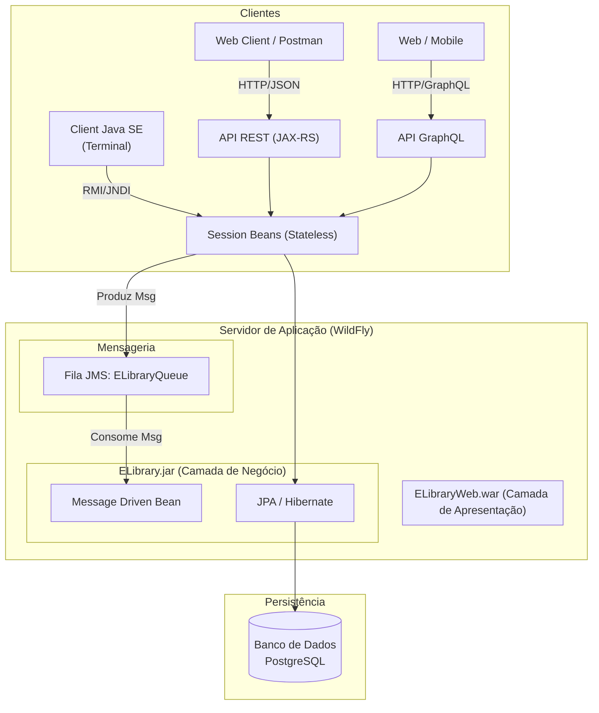

# E-Library - Sistema de Gerenciamento de Biblioteca Distribuída

> **Trabalho Final** da disciplina de Serviços de Suporte a Aplicações Distribuídas.

Este projeto consiste na evolução de um sistema de biblioteca para uma arquitetura distribuída moderna, integrando múltiplos protocolos de comunicação (HTTP/REST, GraphQL, RMI) e processamento assíncrono via Mensageria (JMS), orquestrados por um servidor de aplicação Jakarta EE.

---

## 🏗️ Arquitetura do Sistema

O sistema segue uma arquitetura em camadas, modularizada em um pacote **EAR (Enterprise Archive)**, garantindo separação de responsabilidades e reutilização da lógica de negócio.

### Diagrama de Arquitetura

---
## 🧩 Papel de Cada Serviço
ELibrary (Módulo EJB - Core):

Contém as Entidades JPA (Livro, Exemplar, Emprestimo).

Session Beans: Centralizam as regras de negócio (Cadastro, Validação ISBN, Máquina de Estados de Exemplares).

MDB (Notificador): Consome mensagens da fila JMS para processar notificações de atraso e lista de espera de forma desacoplada.

ELibraryWeb (Módulo Web):

API REST: Expõe endpoints para operações CRUD e gerenciamento de status (com suporte a HATEOAS/Redirect 303).

API GraphQL: Fornece consultas agregadas (Dashboard) e flexíveis com filtros dinâmicos.

ELibraryClient (Cliente Java SE):

Aplicação autônoma que simula um sistema legado ou de integração.

Realiza a Importação de Arquivos (XML/JSON) e testes de Mensageria via acesso remoto (JNDI).

---

## 🚀 Tecnologias Utilizadas
Java: JDK 17

Plataforma: Jakarta EE 10

Servidor de Aplicação: WildFly 27.0.0.Final (ou superior)

Banco de Dados: PostgreSQL 14 (compatível com H2 embutido)

APIs: JAX-RS (REST), MicroProfile GraphQL

Mensageria: JMS 2.0 / ActiveMQ Artemis

Build: Maven

---

## ⚙️ Como Rodar Localmente
1. Configuração do Servidor
Baixe e descompacte o WildFly.

Crie os usuários de gerenciamento e aplicação executando o script ./bin/add-user.sh (ou .bat):

Management User: admin / admin (Opcional)

Application User: appuser / Senha123! (Obrigatório para o Client Java SE)

2. Deploy
Importe o projeto no Eclipse (File -> Import -> Existing Projects).

Certifique-se de que o projeto ELibraryEAR está adicionado ao servidor WildFly na aba "Servers".

Inicie o servidor e aguarde a mensagem de Deployed.

3. URLs de Acesso
API REST (Listar Livros): http://localhost:8080/ELibraryWeb/api/livros

Schema GraphQL: http://localhost:8080/ELibraryWeb/graphql/schema.graphql

---

## 🧪 Como rodar o Client Java SE (Importação e Testes)
O cliente Java SE é utilizado para validar a Parte 3 (Importação) e a Parte 4 (Mensageria).

Mantenha o servidor WildFly rodando.

No Eclipse, expanda o projeto ELibraryClient.

Localize a classe br.elibrary.client.Main.

Clique com o botão direito -> Run As -> Java Application.

Utilize o menu interativo no console:

Plaintext

=========================================
##      E-LIBRARY CLIENT - MENU DE TESTES   
=========================================

1 - Testar Parte 3: Importação de Arquivos (XML/JSON)
2 - Testar Parte 4: Mensageria (Lista de Espera e Atrasos)
0 - Sair
Opção 1: Lê os arquivos doacao.xml e doacao.json na raiz do projeto e popula o banco via EJBs remotos.

Opção 2: Simula devoluções e verifica atrasos, disparando mensagens para a fila JMS (visíveis no log do servidor).

##  📦 Funcionalidades Implementadas
✅ Parte 1: API REST
POST /livros com suporte a application/x-www-form-urlencoded e Redirect 303.

Validação de unicidade de ISBN.

Controle de fluxo de status (Disponível -> Reservado -> Emprestado) com validação HTTP 409.

✅ Parte 2: GraphQL
Query dashboardBiblioteca: Dados agregados (Total Livros, Disponíveis, Emprestados) sem múltiplas consultas (N+1 problem resolvido).

Query livrosDisponiveis: Filtros combináveis de Autor e Status.

Mutation cadastrarLivro: Com validação de duplicidade.

✅ Parte 3: Integração (Importação)
Leitura de arquivos XML e JSON.

Lógica de "Upsert": Cadastra novos livros e apenas adiciona exemplares se o livro já existir.

✅ Parte 4: Mensageria
Fila de Espera: Dispara notificação assíncrona quando um exemplar fica disponível e há usuários aguardando.

Atrasos: Identificação de empréstimos vencidos e disparo de alertas via JMS.
